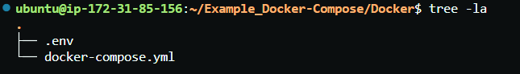
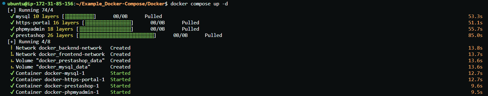
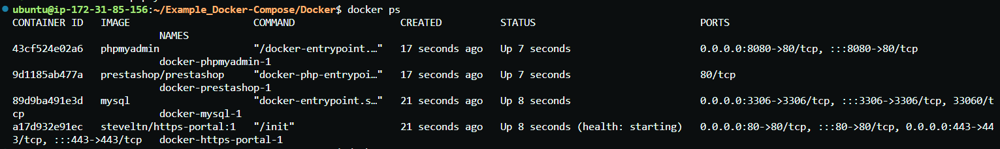
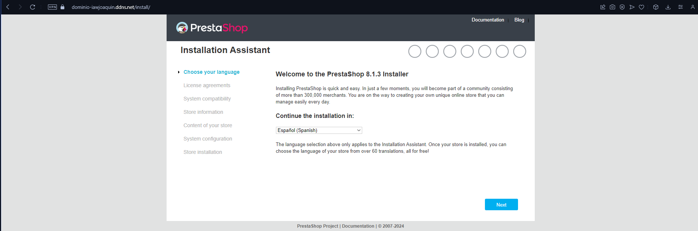
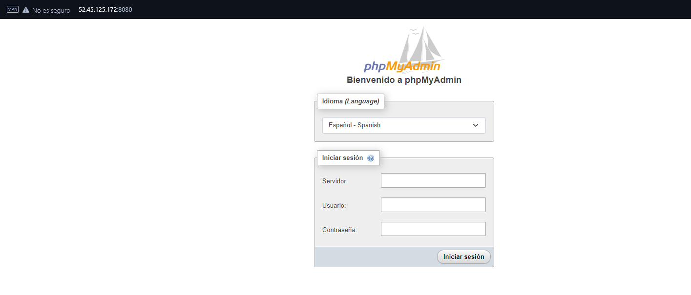

# Example_Docker-Compose
Este repositorio es para comprobar el funcionamiento de una plantilla de Docker-Composer para el certificado HTTPS con Let´s Encrypt en prestashop.


# Plantilla de ejemplo que hemos elegido para realizar la práctica.

- La plantilla que hemos utilizado pertenece al [Apartado 1.1.7](https://josejuansanchez.org/iaw/practica-https-docker/index.html) y tiene la siguiente estructura:

    ```
    version: '3.4'

    services:
    mysql:
        image: mysql
        command: --default-authentication-plugin=mysql_native_password
        ports: 
        - 3306:3306
        environment: 
        - MYSQL_ROOT_PASSWORD=${MYSQL_ROOT_PASSWORD}
        - MYSQL_DATABASE=${MYSQL_DATABASE}
        - MYSQL_USER=${MYSQL_USER}
        - MYSQL_PASSWORD=${MYSQL_PASSWORD}
        volumes: 
        - mysql_data:/var/lib/mysql
        networks: 
        - backend-network
        restart: always
    
    phpmyadmin:
        image: phpmyadmin
        ports:
        - 8080:80
        environment: 
        - PMA_ARBITRARY=1
        networks: 
        - backend-network
        - frontend-network
        restart: always
        depends_on: 
        - mysql

    prestashop:
        image: prestashop/prestashop
        environment: 
        - DB_SERVER=mysql
        volumes:
        - prestashop_data:/var/www/html
        networks: 
        - backend-network
        - frontend-network
        restart: always
        depends_on: 
        - mysql

    https-portal:
        image: steveltn/https-portal:1
        ports:
        - 80:80
        - 443:443
        restart: always
        environment:
        DOMAINS: 'practicahttps.ml -> http://prestashop:80'
        STAGE: 'production' # Don't use production until staging works
        # FORCE_RENEW: 'true'
        networks:
        - frontend-network

    volumes:
    mysql_data:
    prestashop_data:

    networks: 
    backend-network:
    frontend-network:

    ```

## ¿Que funcionalidades realiza cada apartado?

- Si empezamos con `MySql` tenemos su estructura correspondiente.
    ```
    services:
    mysql:
        image: mysql
        command: --default-authentication-plugin=mysql_native_password
        ports: 
        - 3306:3306
        environment: 
        - MYSQL_ROOT_PASSWORD=${MYSQL_ROOT_PASSWORD}
        - MYSQL_DATABASE=${MYSQL_DATABASE}
        - MYSQL_USER=${MYSQL_USER}
        - MYSQL_PASSWORD=${MYSQL_PASSWORD}
        volumes: 
        - mysql_data:/var/lib/mysql
        networks: 
        - backend-network
        restart: always
    ```

- Primero tenemos que definir la imagen que queremos utilizar. También vemos como se usa el comando de `mysql_native_password` para que así no exista problema con el sistema de contraseñas dentro de `MySql`

- `Ports: Son los puertos que utilizamos para conectarnos`

- Y otro apartado importante aparte de referenciar las variables que queremos del *_.env_* es el comando `restart:always` que quiere decir que cada vez que apaguemos el sistema este *_docker_* se iniciará.


## Apartados importantes de la infraestructura de *_PhPMyAdmin_*

- El código de estructura es similar al anterior pero encontramos una serie de condiciones diferentes que vamos a comentar:

`  environment: 
      - PMA_ARBITRARY=1 ` Esto hace referencia a que permite a los usuarios especificar el servidor de MySql al que quiere conectarse.

- `networks: Para especificar si es el front o back.`

- `depends_on: MySql` --> Quiere decir que `dependen` del servicio de MySql para poder funcionar.

## Apartados importantes de la estructura de *_Prestashop_*

- En la estructura de PrestaShop podemos encontrar lo siguiente:

    ```
    prestashop:
        image: prestashop/prestashop
        environment: 
        - DB_SERVER=mysql
        volumes:
        - prestashop_data:/var/www/html
        networks: 
        - backend-network
        - frontend-network
        restart: always
        depends_on: 
        - mysql
    ```
    - Los apartados importantes a destacar es el `volumen` que escogemos para almacenar la información y el `enviroment` que establece una variable de entorno dentro de nuestro bloque de *_PrestaShop_*

## Estructura para el HTTPS.

- Por último tenemos nuestro certificado HTTPS que tendrá la siguiente estructura: 
    ``` 
    https-portal:
        image: steveltn/https-portal:1
        ports:
        - 80:80
        - 443:443
        restart: always
        environment:
        DOMAINS: 'dominio-iawjoaquin.ddns.net -> http://prestashop:80'
        STAGE: 'production' # Don't use production until staging works
        # FORCE_RENEW: 'true'
        networks:
        - frontend-network
    ```

- Donde los apartados mas importantes es el `domains` que tiene que hacer referencia a nuestro nombre de *_dominio_* y el `stage` que hace referencia al estado del contenedor.

## Capturas del funciomiento.

- Si hemos creado nuestro `directorio` con nuestros archivos correspondientes dentro:

    

- Haciendo uso del comando `docker compose up -d` podremos observar como comienza la instalación de la estructura anteriormente mencionada.

    

- Una vez tengamos los docker instalados, con `docker compose ps` podemos ver si estan funcionando.

    

- Si accedemos a nuestro nombre de dominio encontraremos *_prestashop_* para su correspondiente instalación.

    

- También desde la *_ip elástica_* podemos ver el `phpmyadmin`.

    